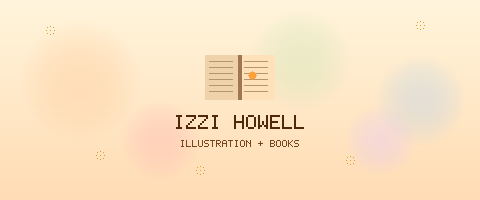

<div align="center">
  

  [](https://nextjs.org/)
  [](https://developer.mozilla.org/en-US/docs/Web/JavaScript)
  [](https://sass-lang.com/)

  **📚 Portfolio website for Izzi Howell, children's book illustrator — built with Next.js and SCSS 🎨**

</div>

---

## 🗂️ Sections

- 🖼️ **Hero** — full-width header with navigation
- 📖 **Books** — gallery of published books with individual cards
- 🏆 **Awards** — showcase of recognitions
- 📸 **Instagram** — integrated Instagram feed section
- 👣 **Footer** — contact and social links

## 🚀 Run locally

```bash
npm install
npm run dev
```

Open `http://localhost:3000`.

## 🏗️ Build

```bash
npm run build
npm start
```

## 🛠️ Tech Stack

- **Next.js 11**
- **React 17**
- **SCSS modules** — component-scoped styles
